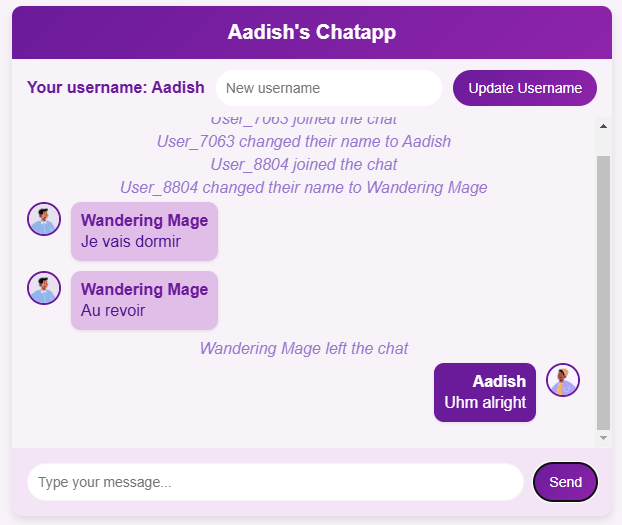

This project is a web chat app based on flask socketio.  

eatures supported are:  
User joining broadcast  
User leaving broadcast  
User update username  
User name update broadcast  
Random avatars generated using https://avatar-placeholder.iran.liara.run/  
Message texts  

